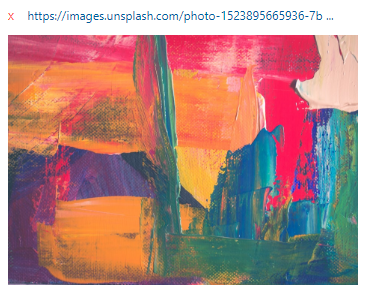

# Href Linke Control

This control was created to offer you the ability of showing a link as image and give it the option to be open in new tab

# Install in Azure Devops 

deffine a field for this as string, (mandatory)
deffine if this control should show image or just a link (true-only if you going to link images)

 

 

 

# Simple - Use it

write the link in the input box

 

after writing the link, the input box turn to a Href link

 

for changing or delete it, just press the red X button

# Enjoy The view

after the link is written

 

contact me :
avih75@gmail.com