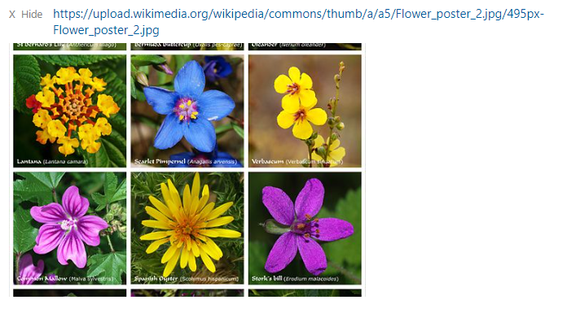

# Href Linke Control

This control was created to offer you the ability of showing a link as image and give it the option to be open in new tab

# Install in Azure Devops 

deffine a field for this as string, (mandatory) that will contain the link 

 

 

 

# Simple - Use it

write the link in the input box

 

after writing the link, the input box turn to a Href link

 

for changing or delete it, just press the red X button

# Enjoy The view

after the link is written you can press the red "show" to reveal the image or press the hide, to hide it back.

 

in case of wrong link....

 

contact me :
avih75@gmail.com